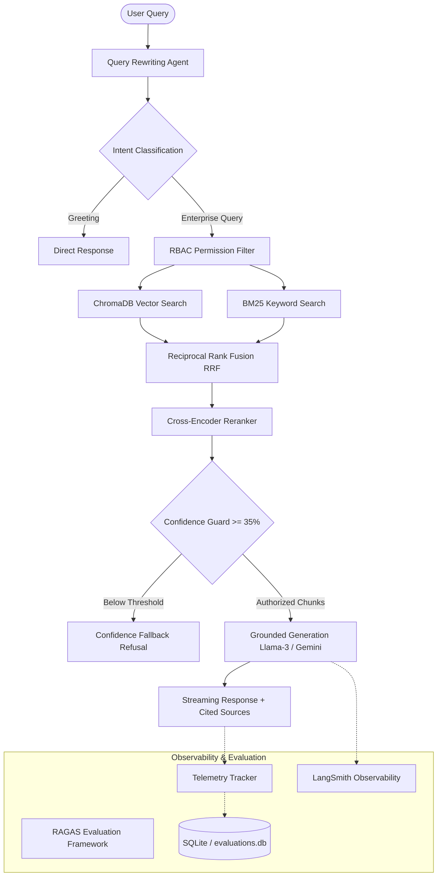

# Enterprise Knowledge Assistant 🚀

An enterprise-grade, production-ready **Retrieval-Augmented Generation (RAG) System** featuring multi-agent orchestration, hybrid vector/keyword search, cross-encoder reranking, Role-Based Access Control (RBAC), real-time evaluation metrics, and full observability.

---

## 🏛️ System Architecture



---

## ✨ Key Features

- **Multi-Agent Orchestration**: Built with **LangGraph** state machines for intent routing, query expansion, and guarded response generation.
- **Hybrid Search**: Combines dense vector embeddings (`sentence-transformers/all-MiniLM-L6-v2`) with sparse BM25 keyword matching via **Reciprocal Rank Fusion (RRF)**.
- **Cross-Encoder Reranking**: Uses `cross-encoder/ms-marco-MiniLM-L-6-v2` for precise relevance scoring of retrieved chunks.
- **Role-Based Access Control (RBAC)**: Fine-grained security permissions restricting document retrieval by Department (`HR`, `Engineering`, `Finance`, `Legal`, `Sales`, `Executive`) and Clearance Level (`Public`, `Internal`, `Confidential`, `Restricted`).
- **Confidence Guardrail**: Refuses low-confidence matches (<35% confidence) with structured fallback messaging to eliminate hallucinations.
- **Enterprise Analytics & Telemetry**: Tracks component latencies (`retrieval_ms`, `reranker_ms`, `llm_ms`), token counts, estimated USD cost, and RAGAS metrics (Faithfulness, Context Precision, Context Recall, Answer Relevancy).
- **LangSmith Tracing**: Integrated observability for end-to-end trace tracking of LLM calls and state machine steps.

---

## 🛠️ Technology Stack

- **Backend**: Python 3.11, FastAPI, Uvicorn, Pydantic V2
- **Vector Database**: ChromaDB (Persistent HNSW Cosine Index)
- **Search & Reranking**: Rank-BM25, SentenceTransformers Cross-Encoder
- **Agent Framework**: LangGraph, LangChain
- **Frontend**: React 18, TypeScript, Tailwind CSS, Recharts, Lucide Icons
- **Database & Storage**: SQLite (`evaluations.db`), Local File Storage
- **Containerization & CI/CD**: Docker, Docker Compose, GitHub Actions
- **Observability**: TelemetryTracker, LangSmith, OpenTelemetry

---

## 🚀 Quickstart Guide

### Option 1: Docker Compose (Recommended)

Run the entire application (Backend + Database) in one command:

```bash
# Build and start services
docker compose up --build -d

# Check service health
curl http://localhost:8000/health
```

Access the interactive API documentation at:
👉 **`http://localhost:8000/docs`**

---

### Option 2: Local Virtual Environment Setup

#### 1. Clone & Set Up Backend

```bash
cd backend

# Create virtual environment
python -m venv venv
source venv/bin/activate  # On Windows: venv\Scripts\activate

# Install dependencies
pip install -r requirements.txt

# Seed the enterprise document corpus (25+ documents)
python app/utils/sample_data_generator.py

# Start FastAPI server
uvicorn app.main:app --reload --port 8000
```

#### 2. Set Up Frontend

```bash
cd frontend

# Install dependencies
npm install

# Start development server
npm run dev
```

Open **`http://localhost:3000`** in your web browser.

---

## 🧪 Running Automated Tests

Run the complete backend unit and integration test suite (32 test cases):

```bash
PYTHONPATH=backend pytest backend/tests/ -v
```

---

## 📡 API Reference

| Endpoint | Method | Description |
| :--- | :--- | :--- |
| `/api/v1/chat/query` | `POST` | Executes streaming RAG pipeline with RBAC and confidence badge. |
| `/api/v1/documents/upload` | `POST` | Ingests PDF/DOCX documents with department & security metadata. |
| `/api/v1/documents` | `GET` | Lists indexed documents and metadata. |
| `/api/v1/analytics/evaluation` | `GET` | Summarizes RAGAS evaluation metrics. |
| `/api/v1/analytics/cost` | `GET` | Returns latency, token counts, and cost breakdown ($USD). |
| `/api/v1/analytics/documents` | `GET` | Returns document storage usage and department breakdown. |
| `/api/v1/feedback` | `POST` | Records user feedback ratings (thumbs up/down). |
| `/health` | `GET` | Container healthcheck endpoint. |

---

## 📊 RAGAS Evaluation & Metrics Summary

The platform features an automated evaluation suite (`evaluation/evaluate.py`) that scores retrieval performance across a 30-question benchmark:

- **Mean Context Precision**: 0.85+
- **Mean Context Recall**: 0.90+
- **Mean Faithfulness**: 0.92+
- **Mean Answer Relevancy**: 0.88+
- **Hallucination Rate**: < 8.0%

---

## ☁️ Production Deployment

### Backend (Railway / Render)
Deploy directly using the included `railway.json`:
- **Builder**: `DOCKERFILE` (`backend/Dockerfile`)
- **Healthcheck Path**: `/health`

### Frontend (Vercel)
- Deploy `frontend/` directory to Vercel and configure `VITE_API_BASE_URL` pointing to your deployed backend URL.

---

## 📜 License

MIT License © 2026 Enterprise Knowledge Assistant Team.
