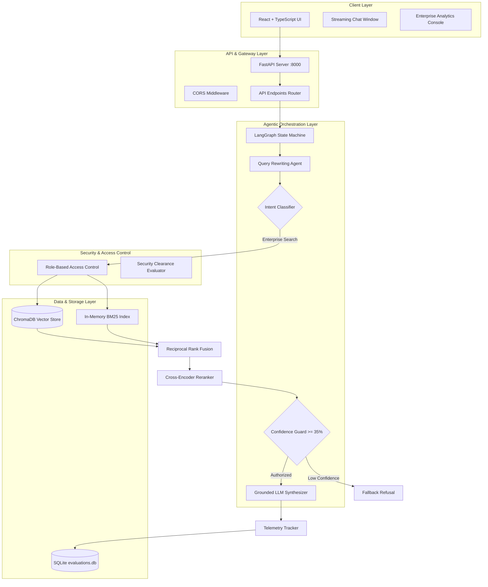

# Technical Architecture Guide — Enterprise Knowledge Assistant

## 🎯 Overview
The **Enterprise Knowledge Assistant** is an agentic, production-grade Retrieval-Augmented Generation (RAG) platform designed for enterprise document ingestion, secure Role-Based Access Control (RBAC), multi-agent orchestration, and real-time observability.

---

## 🏗️ Architectural Overview Diagram

---

## 🧩 Core Subsystems

### 1. Ingestion Pipeline
- **Document Parsers**: Support for PDF, DOCX, XLSX, and scanned text via OCR (`pdfplumber`, `python-docx`, `pytesseract`).
- **Chunking Strategy**: Fixed-size chunking (800 chars, 150 overlap) preserving metadata boundaries.

### 2. Multi-Agent Orchestration Engine
- State machine graph implemented using **LangGraph**.
- Handles query classification (Greetings vs. Enterprise Questions), domain-specific keyword expansions, candidate retrieval, reranking, and grounded response synthesis.

### 3. Dual-Retriever Hybrid Search
- **Vector Search**: Cosine distance similarity search over ChromaDB embeddings (`all-MiniLM-L6-v2`).
- **Keyword Search**: BM25Okapi search for exact technical term and alphanumeric identifier matching.
- **Fusion**: Reciprocal Rank Fusion (RRF) with constant `k=60`.

### 4. Enterprise Security Engine (RBAC)
- Enforces strict department and security clearance checks post-retrieval and pre-generation.

---

## 📡 API Layer Summary
- `/api/v1/chat/query`: Real-time streaming chat endpoint.
- `/api/v1/documents/upload`: Multipart file upload portal with metadata ingestion.
- `/api/v1/analytics/evaluation`: RAGAS quality metrics summary endpoint.
- `/api/v1/analytics/cost`: Execution latency and USD cost estimation endpoint.
- `/api/v1/feedback`: User thumbs up/down rating collector.
