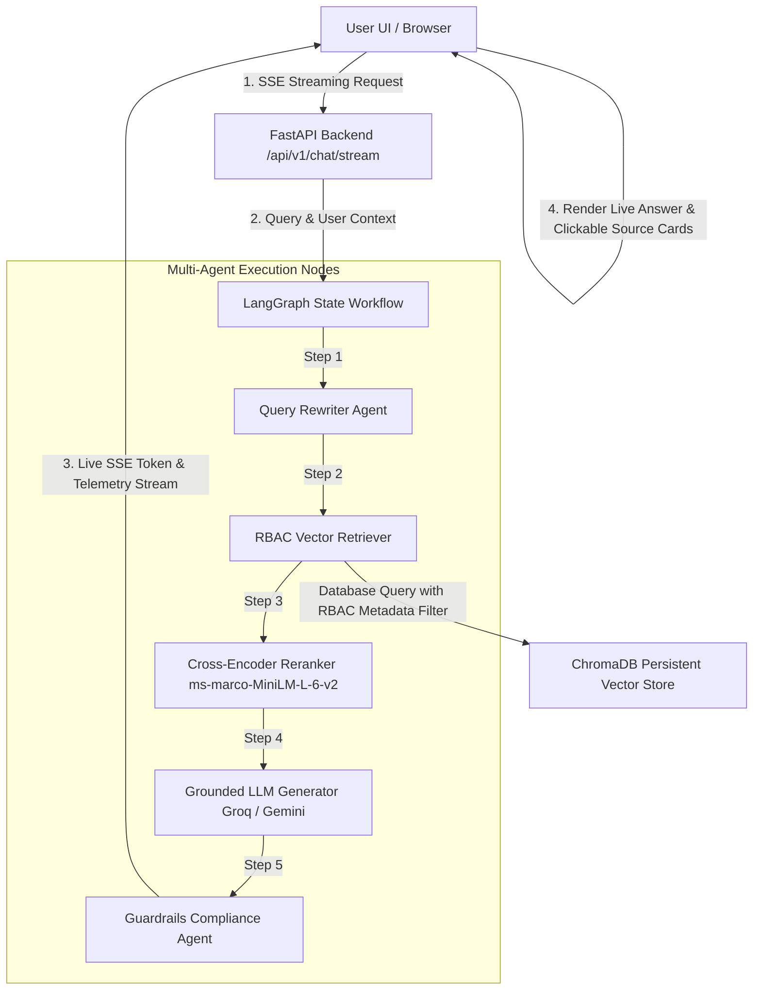

# 📐 Enterprise Knowledge Assistant — Phase 4 System Architecture

Below is the complete Phase 4 end-to-end production architecture diagram for the **Enterprise Knowledge Assistant**.

---

## 1. 🔄 End-to-End System Workflow (Mermaid Diagram)



---

## 2. 🐳 Docker & Infrastructure Topology

```
┌─────────────────────────────────────────────────────────────────────────────┐
│                            Docker Compose Host                              │
│                                                                             │
│   ┌───────────────────────────┐           ┌─────────────────────────────┐   │
│   │   frontend (Port 80)      │           │    backend (Port 8000)      │   │
│   │   Nginx Alpine Container  │           │   FastAPI Python 3.11       │   │
│   │   React TS Production     │ ──proxy──►│   LangGraph + Reranker      │   │
│   └───────────────────────────┘           └──────────────┬──────────────┘   │
│                                                          │                  │
│                                                          ▼                  │
│                                           ┌─────────────────────────────┐   │
│                                           │  ChromaDB Volume Storage    │   │
│                                           │  /app/chroma_db persistence │   │
│                                           └─────────────────────────────┘   │
└─────────────────────────────────────────────────────────────────────────────┘
```

---

## 3. 🚀 Cloud Deployment Environments

| Component | Local Environment | Cloud Production Platform |
| :--- | :--- | :--- |
| **Frontend UI** | `http://localhost:3000` (Vite) | **Vercel** / **Netlify** |
| **Backend API** | `http://localhost:8000` (Uvicorn) | **Railway** / **Render** / **AWS** |
| **Vector DB** | `./backend/chroma_db` (PersistentClient) | Mounted Persistent Volume |
| **CI/CD** | `pytest` / `npm test` | **GitHub Actions** (`.github/workflows/ci.yml`) |
